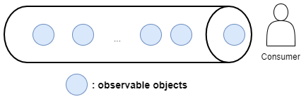
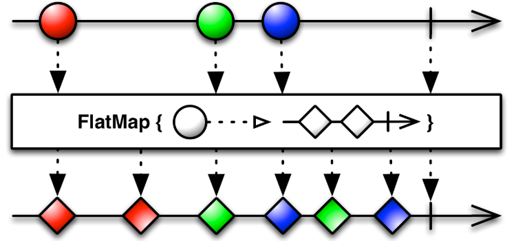
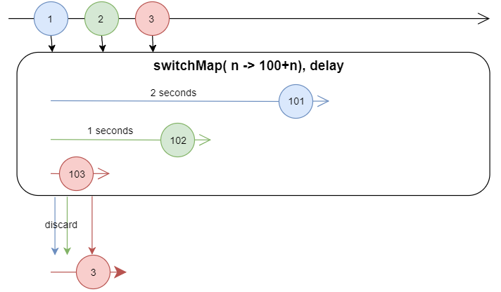
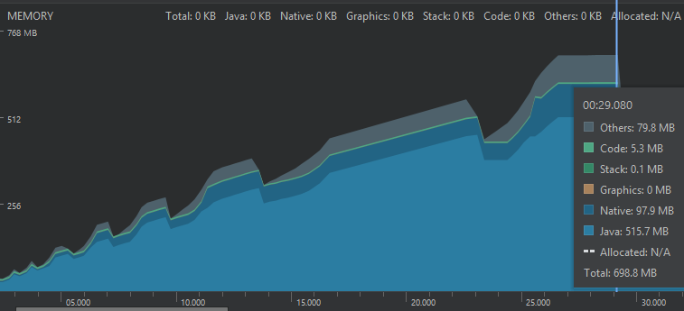

# RxJava 2 introduction

## What is RxJava 2?
A library for composing **asynchronous** and **event-based** programs using **observable sequences** for the Java VM. It extends the **observer pattern** to support sequences of data/events and adds operators that allow you to compose sequences together declaratively while abstracting away concerns about things like low-level threading, synchronization, thread-safety and concurrent data structures.

## Getting started
* Observer pattern
<p align="center">

</p>

* Observable objects are data. In RxJava 2, class `Observable` represents the source of data.
* Observer listening to the observable objects.
* An `Observable` emit items, an observer consumes these items.
* The consumer consumes the items in the method `subscribe()`.

> Notice: In RxJava documentation, **emission**, **emits**, **item**, **event**, **signal**, **data** and **message** are  considered synonyms and represent the object traveling along the dataflow.

#### Hello world
``` Java
Observable<String> helloWorld = Observable.just("Hello World!"); // create a Observable
helloWorld.subscribe(
       str -> System.out.println(str)  // Subscriber consuming items.
);
```

#### Observable
`Observable` is the source of data. It can emit any number of item(including zero item). It can also terminate either successfully or with an error.
* A `Observable` can have any number of consumer(subscriber, observer).
* `onNext()` method is called on each subscriber if a new item is emitted from the `Observable`
* `onComplete()` method is called on each subscriber if the `Observable` finishes its dataflow successfully.
* `onError()` method is called on each subscriber if the `Observable` finishes its dataflow with an error.

``` Java
Observable<String> helloWorld = Observable.just("Hello World!"); // create a Observable
helloWorld.subscribe(
        str -> System.out.println(str),  // onNext()
        e -> System.out.println(e),       // onError()
        () -> System.out.println("completed") // onComplete()
);
```

## Creating data
* `Observable.just()`: create an `Observable` that emits a particular item.
* `Observable.fromArray()`: create an `Observable` that contains an array of items.
* `Observable.interval()`: create an `Observable` that generates an infinite, ever increasing numbers(`Long` type of default vale `0L` ).
* `Observable.range()`: create an `Observable` that generates a sequences of integer number).
* `Observable.empty()`: create an `Observable` with empty item.
* `Observable.timer()`: After a specified time, this `Observable` signals a single `0L`.
* `Observable.fromCallable()`: Create an `Observable` that emits a value (or throw exception) returned by a given `java.util.concurrent.Callable`.

> More creation operators could be found [here](https://github.com/ReactiveX/RxJava/wiki/Creating-Observables)

## Transformation operators
* `Observable.map()`: change the type of the emitted items by applying the given function.
* `Observable.flatMap()`: convert each item emitted by a reactive source to a `Observable` by applying the given function, then merge and emit the result.
* `Observable.concatMap()`: convert each item emitted by a reactive source to a `Observable` by applying the given function, then concat and emit the result.
* `Observable.switchMap()`: convert each item emitted by a reactive source to a `Observable` by applying the given function, then emit only the most recent result.
* `Observable.buffer()`: gather a set of items into a buffer and emit them all at once.
* `Observable.groupBy()`: group the items according to a specified criterion, and emits these grouped items as a `GroupedObservable` or `GroupedFlowable`

> More transformation operators could be found [here](https://github.com/ReactiveX/RxJava/wiki/Transforming-Observables)

##### What is the difference between `flatMap()`, `concatMap()` and `switchMap()`?
* `flatMap()` does NOT care about order
* `concatMap()` cares about order
* `switchMap()` emits the most recent item.

**FlatMap()**


**switchMap()**


## More operators...
More operators could be found [here](https://github.com/ReactiveX/RxJava/wiki/Alphabetical-List-of-Observable-Operators). Some common operators are:
* [Combining operators](https://github.com/ReactiveX/RxJava/wiki/Combining-Observables)
* [Conditional & Boolean Operators](https://github.com/ReactiveX/RxJava/wiki/Conditional-and-Boolean-Operators)
* [Mathematical and aggregate operators](https://github.com/ReactiveX/RxJava/wiki/Mathematical-and-Aggregate-Operators)
* [Filtering operators](https://github.com/ReactiveX/RxJava/wiki/Filtering-Observables)


## Async
Observer consumes the items on the `subscribe()` method, which is by default running on main thread. `Observable` generates dataflow on the main thread as well. We hope, `Observable` could do its job on a background thread and the observer could consume the data on another thread. RxJava makes it easy. We need `subscribeOn()` and `observerOn()` operators.

`subscribeOn()` tells the `Observable` which thread to generate and emit items. It does not matter where you put this method in your observable chain of operators. All operators from upstream to downstream are on the same thread.

`observerOn()` switches the working thread for all remaining operators.

> Reference: [Understanding RxJava subscribeOn and observeOn](https://proandroiddev.com/understanding-rxjava-subscribeon-and-observeon-744b0c6a41ea)

## Schedulers
The `observerOn()` and `subscribeOn()` methods take an arguments of type `Scheduler`. RxJava has already created a set of `Scheduler` for the common case.
* `Schedulers.io()`: for I/O intensive work
* `Schedulers.computation()`: for CUP intensive work
* `Schedulers.newThread()`: creates a new thread for each scheduled unit work.
* `Schedulers.trampoline()`: execute works in a FIFO manner on the current thread.
* `Schedulers.single()`: a default, shared, single-thread-backed Scheduler instance for work requiring strongly-sequential execution on the same background thread.

## Hot and cold observables
Two type of observables: hot and cold

#### Cold observables
Cold observables are observables that emit items only if they are subscribed to. A observables could have multiple subscriber, all subscriber receive the same dataflow no matter when the items created and when it is subscribed to.

For example: `just()`, `range()`, `from()`, `interval()`, `timer()` are cold observables.

#### Hot observables
Hot observables emit the items independent of individual subscriptions. It has its own timeline and emits items on matter how many subscriber (0 or more) is listening to. All subscribers receive the same items from the host observables.

#### Convert cold observables to hot observables
The easiest way to convert a cold observables to hot observables is using the `publish()` operators. `publish()` operator returns a `ConnectableObservable` object, once we call `ConnectableObservable.connect()`, the host observables begin to emit items to its subscribers.

> Reference: [Hot and Cold observables](https://github.com/Froussios/Intro-To-RxJava/blob/master/Part%203%20-%20Taming%20the%20sequence/6.%20Hot%20and%20Cold%20observables.md)


## Single, Completable, Maybe
Like `Observable`, RxJava provides several base classes which are able to generate a dataflow, emit items and be subscribed to.

* `Single` emits always either one value or an error.
* `Completable` emits no item but a completion or an error. It focus on whether the job is done or not. The subscriber receives no item.
* `Maybe` emits a single value, empty value or an error.

Unlike `Observable`, which provides `onNext()`, `onError()`, `onComplete()` method for subscriber,  these base classes have different method for subscriber.
* `Single` class provides only `onSuccess()` and `onError()` method.
* `Completable` class provides only `onComplete()` and `onError()` method.
* `Maybe` class provides `onSuccess()`, `onError()` and `onComplete()`

## Flowable
Simply put, `Flowable` is a backpressure-aware `Observable`.

## Backpressure
Simply put, **Backpressure** is when in an `Flowable` processing pipeline, some **asynchronous** stages can't process the values fast enough and need a way to tell the upstream producer to slow down.

#### What is the problem?

In the following example, we emit one item every milliseconds, but subscriber could only consume one item per second. The rest 999 items are added to the Buffer every second. In the early RxJava, the buffer is unbounded. As time goes on, it might cause OOM.
``` Java
Observable.interval(1, TimeUnit.MILLISECONDS)
          .observeOn(Schedulers.computation()) // async. In a different thread(scheduler)
          .subscribe(l -> {
              Thread.sleep(1000);
              System.out.println(l);
          });
```

Another example:
``` java
Observable.create(emitter -> {
             for(int i = 0 ; ; i++){
                 emitter.onNext(i);
             }
         }).observeOn(Schedulers.computation()) // async. In a different thread(scheduler)
           .subscribe(l -> {
               Thread.sleep(1000);
               Log.d(TAG, "onCreate: " + l);
           });
```
Memory usage graph:


#### Solution
**Backpressure** which is a form of *flow control* where the operators can express how many items are they ready to process. This allows constraining the memory usage of the dataflows in situations where there is generally no way for a step to know how many items the upstream will send to it.

In RxJava 2, the dedicated `Flowable` class is designated to support backpressure and `Observable` is dedicated for the non-backpressured operations (short sequences, GUI interactions, etc.). The other types, `Single`, `Maybe` and `Completable` don't support backpressure nor should they; there is always room to store one item temporarily.

The difference between `Observable` and `Flowable` is that `Flowable` supports backpressure and `Observable` does not support backpressure.

In modern RxJava, most asynchronous operators of a `Flowable` now have a bounded internal buffer (defalut 128 elements), like `observeOn()`, and any attempt to overflow this buffer will terminate the whole sequence with  `MissingBackpressureException`.

* `Observable` does not support backpressure and has an unbounded internal buffer.
* `Flowable` supports backpressure and has a bounded internal buffer.

#### Backpressure strategy
Most developers encounter backpressure when their application fails with `MissingBackpressureException` and the exception usually points to the `observeOn` operator. The actual cause is usually the non-backpressured use of `PublishProcessor`, `timer()` or `interval()` or custom operators created via `create()`.

There are several ways of dealing with such situations.
* Increasing buffer. Temporary fix the problem, overflow can still happen if the source produces over the buffer size.
* `onBackpressureBuffer()`: reintroduces an unbounded buffer.
* `onBackpressureBuffer(int capacity)`: specify a new size of buffer, throw a `BufferOverflowError` if buffer reaches the given capacity.
* `onBackpressureBuffer(int capacity,Action onOverflow)`: this overload calls a (shared) action in case an overflow happens.
* `onBackpressureBuffer(int capacity,Action onOverflow, BackpressureOverflowStrategy strategy)`:   define what to do in case the capacity has been reached.
There are 3 strateties:
  * `ERROR`: this is the default behavior of the previous two overloads, signaling a BufferOverflowException.
  * `LATEST` : if an overflow would happen, the current value will be simply ignored and only the old values will be delivered once the downstream requests.
  * `OLDEST` : drops the oldest element in the buffer and adds the current value to it.


* `onBackpressureDrop()`: whenever the downstream is not ready to receive values, this operator will drop that elemenet from the sequence.  
* `onBackpressureLatest()`: the final operator keeps only the latest value and practically overwrites older, undelivered values.
